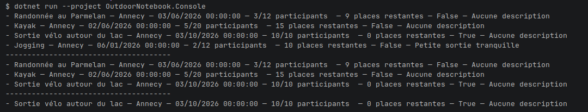
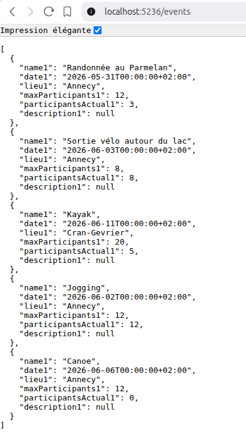

<a name="readme-top"></a>


<br />
<div align="center">

<h3 align="center">OutdoorNotebook</h3>

  <p align="center">
    Bienvenue sur le projet : OutdoorNotebook !
    <br>
Vous lisez actuellement la documentation, bonne lecture :)
  </p>
</div>

<details>
  <summary>Tables des matières :</summary>
  <ol>
    <li>
        <a href="#le-projet">Le projet</a>
</li>
<li>
        <a href="#prerequis">Prérequis</a>
</li>
<li>
        <a href="#installation">Installation</a>
</li>
<li>
        <a href="#compilation">Compilation</a>
</li>
<li>
        <a href="#tests">Tests</a>
</li>
<li>
        <a href="#console">Console</a>
</li>
<li>
        <a href="#api">API</a>
</li>
<li>
        <a href="#exemples">Exemples</a>
</li>
<li>
        <a href="#structures">Structures</a>
</li>

  </ol>
</details>

<br>

---
<br>

# Le projet

<br>

OutdoorNotebook est un petit outil pour une association locale : Les Amis de l’Outdoor.

L’association organise des sorties : randonnée, vélo, trail, ski de fond, etc.

Elle veut un premier outil très simple pour suivre :

- le nom des sorties,
- leur date,
- leur lieu,
- leur nombre de places,
- les participants inscrits,
- éventuellement une courte description.

<p align="right">(<a href="#readme-top">Revenir en haut</a>)</p>

# Prérequis

<br>

Afin d'utiliser OutdoorNotebook, il est nécessaire d'avoir.NET installé sur votre machine.

<br>

<p align="right">(<a href="#readme-top">Revenir en haut</a>)</p>

# Installation

<br>

Pour installer OutdoorNotebook, vous devrez télécharger le code ou faire un clone Git :

```bash
git clone https://github.com/raphaelmakaryan/charp_cnita.git
```

Un dossier ainsi que tout le projet sera affiché sur votre machine.

<br>

<p align="right">(<a href="#readme-top">Revenir en haut</a>)</p>

# Compilation

<br>

Pour compiler OutdoorNotebook, vous devrez faire cette commande :

```bash
dotnet build
```

OutdoorNotebook se générera.

<br>

<p align="right">(<a href="#readme-top">Revenir en haut</a>)</p>

# Tests

<br>

Pour lancer les tests de OutdoorNotebook, vous devrez faire cet commande :

```bash
dotnet test
```

Les tests de OutdoorNotebook se lanceront.

<br>

<p align="right">(<a href="#readme-top">Revenir en haut</a>)</p>

# Console

<br>

Pour lancer la console d'OutdoorNotebook, vous devrez faire cette commande :

```bash
dotnet run --project OutdoorNotebook.Console
```

OutdoorNotebook se lancera avec une liste d'événements préconfigurés.

<br>

<p align="right">(<a href="#readme-top">Revenir en haut</a>)</p>

# API

<br>

Pour lancer l'API de OutdoorNotebook, vous devrez faire cette commande :

```bash
dotnet run --project OutdoorNotebook.Api
```

Un serveur se lancera avec une URL prédéfinie dans votre console.

Il y a 3 routes actuellement disponibles :

- /
- /events
- /events/upcoming

<br>

<p align="right">(<a href="#readme-top">Revenir en haut</a>)</p>

# Exemples

<br>

En quelques images, voici l'utilisation de OutdoorNotebook :




<br>

<p align="right">(<a href="#readme-top">Revenir en haut</a>)</p>

<br>

# Structures

<br>

## Data

Dans ce dossier, il contient un fichier JSON, qui stocke des événements.

## OutdoorNotebook.Api

Dans ce dossier, il contient le fichier Program.cs, qui est le fichier moteur, afin d'avoir les routes/endpoints et le
lancement du serveur.

## OutdoorNotebook.Console

Dans ce dossier, il contient le fichier Program.cs, qui est le fichier moteur, afin d'avoir tous les rendus visibles de
l'outil.

## OutdoorNotebook.Core

Dans ce dossier, il contient :

- EventService : class services qui stocke toutes les méthodes,
- EventStorageService : class qui permet de lire et de désérialiser le fichier JSON "events" et de rendre ces données
  lisibles par la logique métier,
- OutdoorEvents : class maîtresse, qui contient toutes les propriétés ainsi que les méthodes nécessaires pour les
  événements,
- Tools : class d'outils.

## OutdoorNotebook.Tests

Dans ce dossier, il contient le fichier OutdoorNoteBookTests.cs, qui est le fichier qui stocke tous les tests pour
OutdoorNotebook.

<br>

<p align="right">(<a href="#readme-top">Revenir en haut</a>)</p>